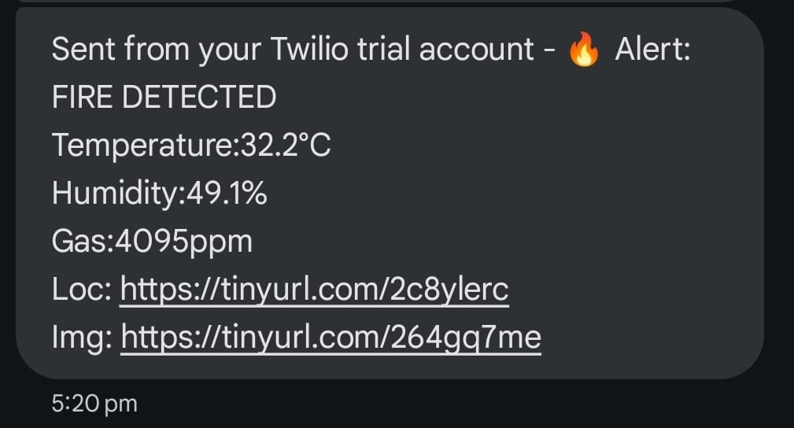
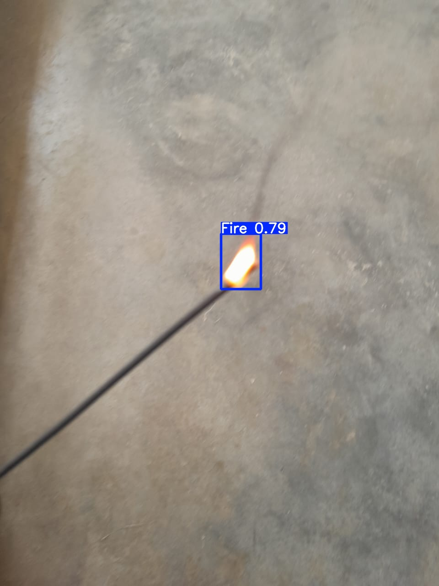

# Early Fire Detection using YOLOv8

An end-to-end intelligent fire detection system leveraging ESP32 microcontrollers, real-time environmental sensors, and deep learning-based image classification using YOLOv8 deployed on Google Cloud. This system ensures timely fire detection by fusing sensor and image data, triggering alerts with location and visual proof via SMS.

## Project Overview

This project integrates hardware and cloud technologies to detect fire incidents with high accuracy and minimal latency. It uses:

- **ESP32** for sensor data acquisition (temperature, humidity, gas)
- **ESP32-CAM** for capturing images when anomalies are detected
- **YOLOv8** on **Google Cloud Run** to analyze images for fire presence
- **Twilio API** to send real-time SMS alerts including sensor values, location, and image links
- **Google Maps Link API** to share GPS coordinates with responders

## Features

- 🔍 **Real-Time Fire Detection** using YOLOv8
- 🌡️ Sensor monitoring (Gas, Temperature, Humidity)
- 📍 GPS-based location tracking
- 🖼️ Image capture on fire trigger
- ☁️ Cloud-based processing (Google Cloud Run, Flask API)
- 📲 Alert notification via Twilio SMS with:
  - Sensor Readings
  - GPS location as Google Maps link
  - Captured Fire Image URL

## Achievements

- 🔁 **92% Detection Accuracy**
- ⚡ Fast response by combining real-time sensor anomalies with image classification
- 📡 Cloud-hosted YOLOv8 inference pipeline using Flask on Google Cloud Run

## Tools & Technologies Used

- **Hardware**: ESP32, ESP32-CAM, DHT11, MQ2 Gas Sensor, GPS Module (u-blox)
- **Software Stack**:
  - YOLOv8 (Ultralytics)
  - Flask (Cloud API)
  - Google Cloud Run (Serverless backend)
  - Google Cloud Storage (Image hosting)
  - Twilio API (SMS notification)
  - Google Maps Link API (Location sharing)

## Setup Instructions

### 1. Hardware Configuration
- Connect the following components to the **ESP32**:
  - **DHT11** for temperature and humidity
  - **MQ2** Gas Sensor for smoke/gas detection
  - **GPS Module (e.g., u-blox NEO-6M)** for location data
- Connect **ESP32-CAM** to ESP32 using UART or GPIO pins for triggering
- Ensure stable **5V power supply** to both ESP32 and ESP32-CAM

### 2. ESP32 Programming
- Flash the ESP32 with Arduino code to:
  - Read sensor values
  - Detect anomalies in gas, temperature, or humidity
  - Send data to Google Cloud endpoint (HTTP POST)
  - Trigger ESP32-CAM if fire-like conditions are detected

### 3. ESP32-CAM Programming
- ESP32-CAM captures image upon trigger
- Uploads image to **Google Cloud Storage** via HTTP POST or signed URL
- You can use ESP32-CAM libraries (like `ESP32HTTPClient` and `WiFiClient`) for HTTP requests

### 4. Google Cloud Setup
- Create a Flask-based API and deploy it on **Google Cloud Run**
- Setup endpoints:
  - `/upload-data`: Accepts sensor data and image metadata
  - YOLOv8 integration endpoint for fire detection
- Use Google Cloud Storage bucket to receive and host uploaded images
- Use **Ultralytics YOLOv8** pretrained or fine-tuned model to detect fire in images

### 5. Twilio Configuration
- Register on [Twilio](https://www.twilio.com/)
- Get your **Account SID**, **Auth Token**, and **Phone Number**
- Integrate Twilio in your Flask app using `twilio` Python package
- Format alert SMS with:
  - Sensor readings
  - Location via Google Maps link
  - Fire image URL

## Example Alert SMS

<table align="center">
  <tr>
    <td align="center" width="50%">
      
      
<strong>Alert Message</strong>

    </td>
    <td align="center" width="50%">
      
      
<strong>Captured fire image using ESP32 CAM</strong>

    </td>
  </tr>
</table>

## 📊 Performance Metrics

| Metric               | Value          |
|----------------------|----------------|
| Detection Accuracy   | 92%            |
| Average Response Time| < 5 seconds    |
| False Positive Rate  | Very Low       |
| Deployment Platform  | Google Cloud Run |
| Notification Delay   | < 3 seconds    |

## Future Enhancements

- 🔒 Image encryption before cloud upload
- 📱 Mobile app for real-time alert tracking
- 🛰️ Use of LoRa or NB-IoT for remote area deployment
- 🧠 Edge ML integration to reduce latency and dependency on cloud

